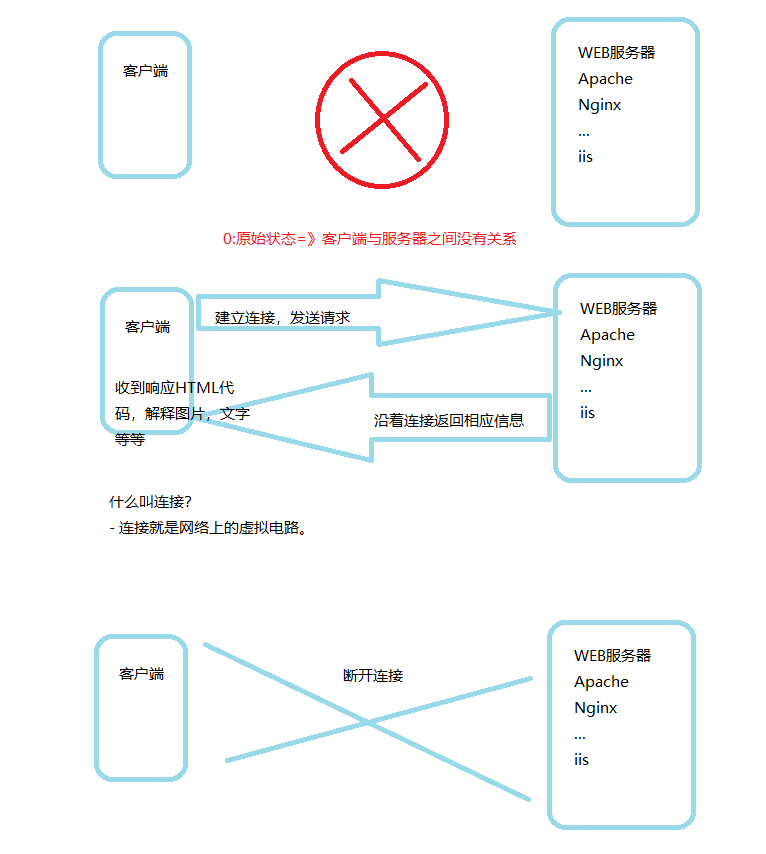
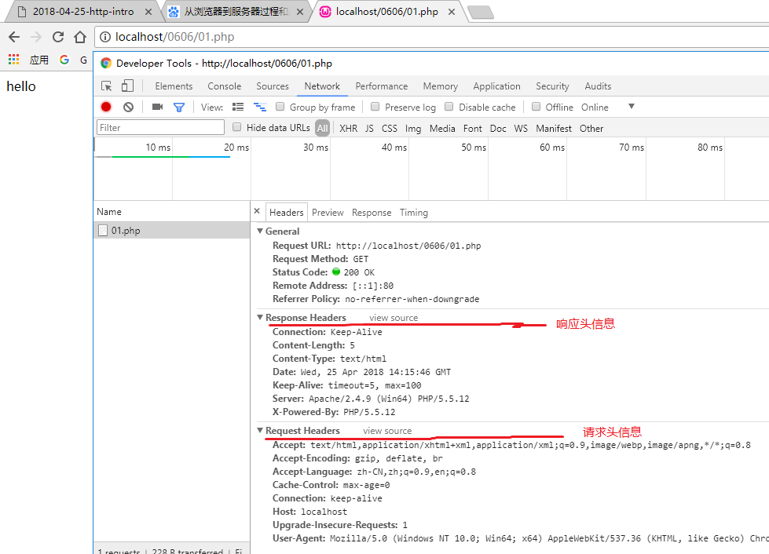
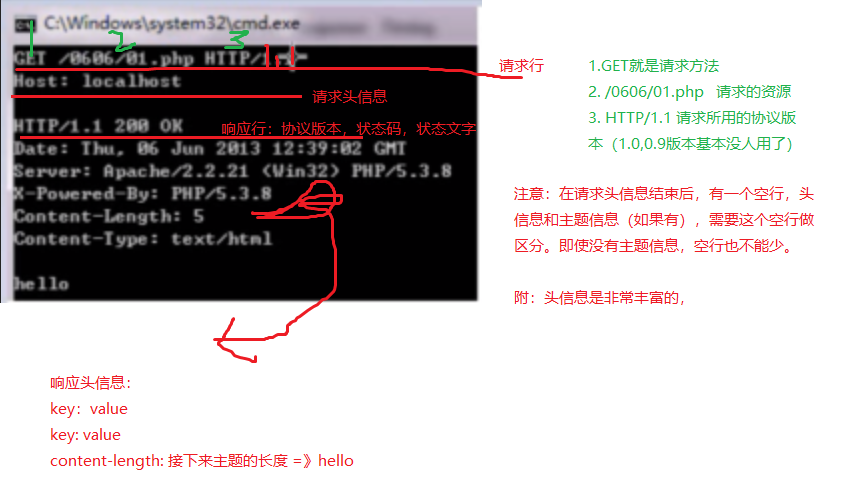

# http

**重要性**
> 无论是以后用webserverice，还是用rest做大型架构，都离不开对HTTP协议的认识。

甚至可以简化说：

- webserverice = http协议+XML
- Rest = HTTP协议 + json
- 各种API一般也是用http+xml/json来实现的

做采集，小偷站也需要对HTTP协议有所了解。

**什么是协议**
> 计算机中的协议和现实中的协议是一样的，一式双份/多份。
双方/多方都遵循的一个共同规范，这个规范就可以称为协议。
http协议即按一定规则向服务器要数据或发送数据，而服务器按一定规则回应数据。

- ftp
- http
- stmp
- pop
- tcp/ip

## 当你打开一个页面时，发生了什么？


## 浏览器发送一次http请求


## http协议的工作流程
1. 发送请求
2. 返回信息
3. 断开请求

**http请求信息和响应信息的格式**

- 请求
	+ 请求行
	+ 请求头信息
	+ 请求主体信息

- 请求行又分3部分
	+ 请求方法
	+ 请求路径 
	+ 请求所用协议及版本

- 请求方法又有多种
	+ GET
	+ POST
	+ PUT
	+ DELETE
	+ TRACE
	+ OPTIONS


**浏览器可以发送http协议，那协议一定要浏览器发送吗？**
> 不是，http仅仅只是一种协议，什么工具都能发。


## 使用telnet发送一次http请求



## 状态码-状态文字

**状态码**
> 是用来反应服务器响应情况的
> 最常见的如：

```
200 OK 服务器成功返回网页
301/302 永久/临时重定向
304 NOT modified 未修改
307 重定向中保持原有的请求数据

失败的状态码：
404 NOT FOUND 请求的网页不存在
503 forbidden 服务器暂时不可用
500 服务器内部错误

// 状态文字是用来描述状态码的，便于人观察。
```

| 状态码 | 定义 | 说明 |
| -----: | ----:  | :----: |
| 1XX | 信息 | 接收到请求，继续处理 |
| 2XX | 成功 | 操作成功地收到，理解和接受 |
| 3XX | 重定向 | 为了完成请求，必须采取进一步措施 |
| 4XX | 客户端错误 | 请求的语法有错误或不能完全被满足 |
| 5XX | 服务端错误 | 服务器无法完成明显有效的请求 |


```php
// 默认是302重定向
header('Location:https://www.baidu.com'); 

// 使用301重定向,true参数意指用301信息替换原来的头信息。
header('Location:https://www.baidu.com',true,301); 


// 对于一篇新闻，GET请求，重定向无所谓，还能看到原来的内容就行
// 但如果是post数据
// 比如 表单提交到=》05.php,但是05.php已经重定向到06.php

// 可以使用307,重定向中保持原有的请求数据
header('Location:https://www.baidu.com',true,307); 

```
